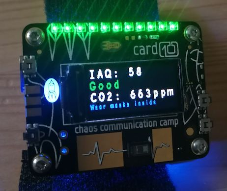

# C10VID - Demo for the BSEC air quality sensors

<https://github.com/ketsapiwiq/c10vid>

This app will show you current CO2 concentration (ppm) and the Index for Air Quality of your environment, and flash LEDs and vibrate accordingly.

This is not based on anything seriously scientific but it could be taken as a clue you need to ventilate the room to diminish risks of COVID-19 contamination.

Based on [@schneider's work](https://git.card10.badge.events.ccc.de/card10/firmware/-/merge_requests/380) for presenting BME680 sensors to Epicardium and Pycardium API.

This is a card10 app (CCCamp badge).

`bsec_enable = true` has to be in your `card10.cfg`.

You will need to flash the latest firmware (v1.17) according to the card10 documentation.

## Resources

<!-- - How to build latest firmware with Docker: https://firmware.card10.badge.events.ccc.de/how-to-build.html#docker -->

- How to flash: https://firmware.card10.badge.events.ccc.de/how-to-flash.html

- Add measures to Phyphox.org app: https://git.card10.badge.events.ccc.de/card10/firmware/-/merge_requests/380
- Documentation on the Bosch chip and what it calculates: https://git.card10.badge.events.ccc.de/card10/hardware/-/raw/master/datasheets/bosch/BST-BME680-DS001.pdf

## TODO:

- Add info from the pulse oxymeter sensor (SPO2 calculation through max86150)
- Improve Pycardium so that it also exposes the "Human Volatile Organic Compounds concentration" measure
  - Also make it exportable in BLE to access it with phyphox
- Fine-tune measures for COVID?
